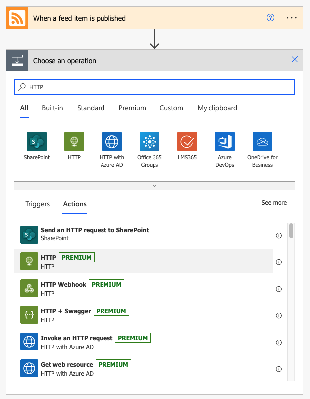
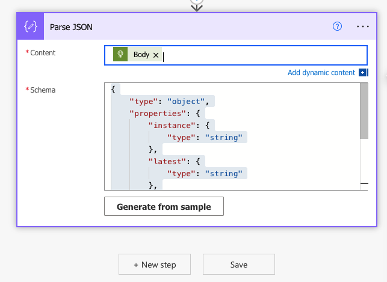

# Creating a Microsoft Flow to email yourself when an Office 365 IP/URL change occurs
This article is an updated method for demonstrating how you can use Microsoft Flow to alert yourself with an email whenever there are changes to the Office 365 IP Addresses or URLs. This improves upon versions originally created by Paul Andrew from where this has been forked.
Improvements include: 1) Updated screen shots that reflected changes in Microsoft Power Automate (previously called Flow), 2) Removing a reliance on setting up an Azure instance to create the nicely formatted e-mail from the raw JSON. 

## Step 1 – Sign up for Microsoft Power Automate

Power Automate requires sign-up. I&#39;ve only used free elements in Power Automate for this. You can read about the sign-up process and the free and paid plans at [https://docs.microsoft.com/en-us/power-automate/sign-up-sign-in](https://docs.microsoft.com/en-us/power-automate/sign-up-sign-in)

Once you&#39;ve signed up you can go to Power Automate at [https://flow.microsoft.com](https://flow.microsoft.com/)

## Step 2 – Create a flow

At the Power Automate home page, select My Flows from the left side navigation menu. On the My Flows page you can select + New flow at the top of the page and select Automated cloud flow.

_Figure 2 - Build your own from Automated Cloud Flow from blank command_

## Step 3 – Add the trigger

A trigger starts your flow executing. We&#39;re going to check the version of the Office 365 network endpoints using the RSS feed.

The RSS feed trigger is not very easy to test so you will want to use the Recurrence trigger for testing so that you get a trigger for the flow once a minute.

Let&#39;s keep going with the RSS trigger here. You can delete it and add the Recurrence to test and then delete your Recurrence and add an RSS trigger back if testing and debugging is needed.

_Figure 3 - Choose your flow&#39;s triggers command_

Click the Choose your flow&#39;s triggers as shown in Figure 3 and enter RSS in the box. It will begin searching immediately and the orange RSS trigger should appear. Select it and click on Create.

There are two parameters for the RSS trigger: the URL to look up and when it will be triggered. This URL will be custom for the service instance that you want to monitor. You can use this URL to get the RSS feed for the most commonly used service instance. It&#39;s called Office 365 Worldwide Commercial/GCC. Leave the other parameter on PublishDate. Then click on the + New step command.

https://endpoints.office.com/version/worldwide?format=rss&AllVersions&clientrequestid=bad1f103-bad1-f103-0123-456789abcdef

_Figure 4 - Configured RSS trigger_

## Step 4 – Adding the actions

Search for the HTTP operation and select it. 

_Figure 5 – HTTP Operation_

Configure the HTTP action to GET the version list for the endpoints from the web service.

https://endpoints.office.com/version/worldwide?allversions&clientrequestid=bad1f103-bad1-f103-0123-456789abcdef

_Figure 6 – Parameters for GET HTTP action_

Click the + New step command below the HTTP action and search for JSON to locate the Parse JSON action.

_Figure 7 – Action search results showing the Parse JSON action_

Configure the Parse JSON parameters to read the results from the web service.

_Figure 8 – Configuring the Parse JSON action_

Click in the Content property window and you will see the dynamic content selector. Choose the Body content item which is the output of the previous action.

_Figure 9 – Selecting the Body content item_

Next, we are going to setup the schema so that the Parse JSON action can read the web service output. Launch a web browser and paste in the URL: https://endpoints.office.com/version/worldwide?allversions&clientrequestid=bad1f103-bad1-f103-0123-456789abcdef

_Figure 10 – Getting a sample output payload for the web service._

Click Generate from sample payload to generate schema.

_Figure 11 – Paste it in from the web browser._

_Figure 12 - Inserted sample JSON (note with the Body in the content box)_

Then click + New Step

Add a second HTTP action and configure it for a GET operation. 

_Figure 13 - Add a new HTTP action_

This second HTTP action is to get a nicely formatted list of changes. It is using a Cloudflare Worker so there is will work as-is in these instructions, but if you would like to see the code running in the worker (or set up your own) that is also included in this repository. The worker I have set up is available at https://o365ipurl.ambor.com/. If you just use the base URL you will get a list of every change, if you add a version search to the URL you will get all changes from a particular version (e.g. https://o365ipurl.ambor.com/?ver=2021072900). The next part of these instructions are to generate the correct URL to get all changes since the last version.

The URI for this HTTP GET is going to be more complex than in the first HTTP GET action as it includes a dynamic parameter. Enter the first part of the URI as:

https://o365ipurl.ambor.com/?ver=

Then click Expression in the expanded right properties window and enter a reference to the second version item from the Parse JSON action. This selects the version prior to the current version so that you can see the latest changes.

**body(**&#39;Parse\_JSON&#39;**)**?[&#39;versions&#39;][1]

_Figure 14 – First part of URI entered_

Click OK to accept the Expression.

_Figure 15 – Expression and second part of URI entered_

Select + New step and search for the Office 365 Send an email action.

_Figure 16 – Searching for the send an email action_

Select the Send an email (V2) action.

Configure the Send an email action with your own email to address. Enter a subject line in two parts. The first part is static:

New Office 365 IPURL changes were published

The second part of the subject will be the version number that we just found. With the cursor at the end of the subject text, select the Expression tab in the expanded right properties window and enter the expression to reference the latest version in the JSON output from the version web service.

**body(**&#39;Parse\_JSON&#39;**)**?[&#39;latest&#39;]

_Figure 17 – Searching for the send an email action_

Next select OK to enter the expression into the Subject and do the same thing for the Body. Enter some static text for the Body.

&quot;Changes to Office 365 IP Address and/or URLs have been published. Here is the change log.&quot;

_Figure 18 – The email action with the subject complete and the static text entered in the body_

Select the HTTP 2 action Body for the rest of the email body.

_Figure 19 – The completed email action. Please substitute your own email address_

You are complete and can now save the flow.

_Figure 20 – The save button at the bottom of the flow_

_Figure 21 – The completed flow_

