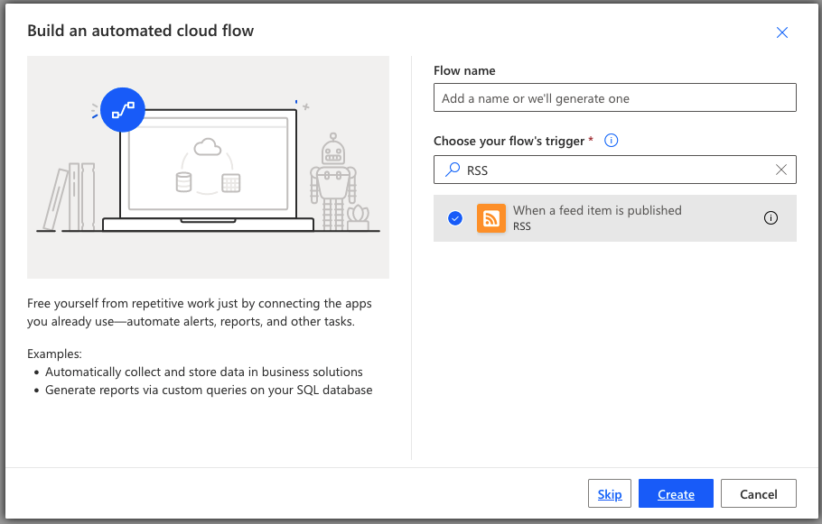

# Creating a Microsoft Flow to email yourself when an Office 365 IP/URL change occurs
This article is an updated method for demonstrating how you can use Microsoft Flow to alert yourself with an email whenever there are changes to the Office 365 IP Addresses or URLs. This improves upon versions originally created by Paul Andrew from where this has been forked.
Improvements include: 1) Updated screen shots that reflected changes in Microsoft Power Automate (previously called Flow), 2) Removing a reliance on setting up an Azure instance to create the nicely formatted e-mail from the raw JSON. 

## Step 1 – Sign up for Microsoft Power Automate

Power Automate requires sign-up. I&#39;ve only used free elements in Power Automate for this. You can read about the sign-up process and the free and paid plans at [https://docs.microsoft.com/en-us/power-automate/sign-up-sign-in](https://docs.microsoft.com/en-us/power-automate/sign-up-sign-in)

Once you&#39;ve signed up you can go to Power Automate at [https://flow.microsoft.com](https://flow.microsoft.com/)

## Step 2 – Create a flow

At the Power Automate home page, select My Flows from the left side navigation menu. On the My Flows page you can select + New flow at the top of the page and select Automated cloud flow.

_Figure 2 - Build your own from Automated Cloud Flow from blank command_

## Step 3 – Add the trigger

A trigger starts your flow executing. We&#39;re going to check the version of the Office 365 network endpoints using the RSS feed.

The RSS feed trigger is not very easy to test so you will want to use the Recurrence trigger for testing so that you get a trigger for the flow once a minute.

Let&#39;s keep going with the RSS trigger here. You can delete it and add the Recurrence to test and then delete your Recurrence and add an RSS trigger back if testing and debugging is needed.

_Figure 3 - Choose your flow&#39;s triggers command_

Click the Choose your flow&#39;s triggers as shown in Figure 3 and enter RSS in the box. It will begin searching immediately and the orange RSS trigger should appear. Select it and click on Create.

There are two parameters for the RSS trigger: the URL to look up and when it will be triggered. This URL will be custom for the service instance that you want to monitor. You can use this URL to get the RSS feed for the most commonly used service instance. It&#39;s called Office 365 Worldwide Commercial/GCC. Leave the other parameter on PublishDate. Then click +New step

https://endpoints.office.com/version/worldwide?format=rss&AllVersions&clientrequestid=bad1f103-bad1-f103-0123-456789abcdef

_Figure 4 - Configured RSS trigger_
